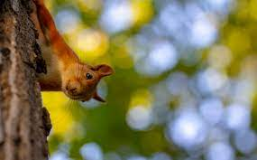
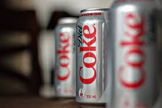

# KG3
lab3, Hryshkin

## Task

Write an application / web application that implements the image processing methods specified in the variant. 

## Initial

## Processing

## Histogram

## the requirements 
* win10 latest versionr

## Installation and usage

Run app.exe